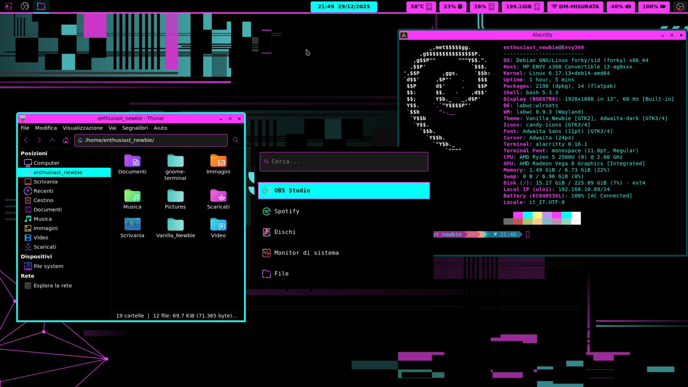

# Vanilla Newbie Theme - Labwc Edition 

Benvenuti nel repository ufficiale di **Vanilla_Newbie**, un ambiente desktop minimale, basato su **LabWC** (Wayland). 

Questo setup è creato appositamente per chi ama il **Total Black** con forti accenti **Magenta Neon** e **Ciano**. Se sei un Nebwbie di Linux,come me, non preoccuparti: questa guida ti accompagnerà passo dopo passo.



---

## 🎨 Caratteristiche del Tema
* **Sfondo:** Nero Assoluto (#000000) per il massimo riposo degli occhi.
* **Bordi Finestre:** Ciano Neon (#00FFF7) con effetto cornice marcato.
* **Barre del Titolo:** Magenta Neon (#FA39FA) con testo nero per un contrasto perfetto.
* **Coerenza:** Lo stile è applicato a Terminale, Cartelle (GTK 3 e 4), Barra di sistema e Launcher.

---

## 📦  1. Requisiti (Cosa installare prima)
Prima di applicare il tema, assicurati di aver installato i componenti necessari sul tuo sistema.
> Oppure puoi installare le dipendenze insieme a tutti i dotfiles lanciando lo script di installazione (vedi sotto : 2.1 INSTALLAZIONE TRAMITE SCRIPT Opzione B)

**Su Debian/Ubuntu e derivate:**
```bash
sudo apt update && sudo apt install -y labwc xwayland alacritty wofi waybar swaybg xdg-user-dirs xdg-utils xdg-desktop-portal xdg-desktop-portal-wlr qtwayland5 qt6-wayland-dev thunar thunar-volman gvfs gvfs-backends udisks2 thunar-archive-plugin pipewire wireplumber pavucontrol pamixer brightnessctl network-manager network-manager-gnome bluez blueman lxpolkit fonts-noto fonts-font-awesome mako-notifier grim slurp build-essential nwg-look git screenfetch
```
---

## 2. INSTALLAZIONE MANUALE (Opzione A)

### Start : Scarica il Progetto
Per prima cosa, scarica la cartella del progetto: 
```bash
git clone https://github.com/EnthusiastNewbie/Vanilla_Newbie_Theme.git
```
ed entra nella directory:
```bash
cd Vanilla_Newbie_Theme/Vanilla_Newbie_Theme_Labwc
```

### Passo 1: Copia del Tema Completo
Copia la cartella del tema nella directory dei temi utente.
```bash
mkdir -p ~/.local/share/themes
cp -r Vanilla_Newbie ~/.local/share/themes/
```

### Passo 2: Copia dei Dotfiles (Configurazioni)
Crea le cartelle e copia i file di configurazione.
```bash
mkdir -p ~/.config/{labwc,waybar,wofi,alacritty}

cp -r labwc/* ~/.config/labwc/
cp -r waybar/* ~/.config/waybar/
cp -r wofi/* ~/.config/wofi/
cp alacritty/alacritty.toml ~/.config/alacritty/
```

### Passo 3: Override GTK (Opzionale ma consigliato)
Per assicurarti che le app GTK4 (Libadwaita) rispettino i colori del tema, creiamo dei link simbolici alle configurazioni:
```bash
mkdir -p ~/.config/gtk-3.0 ~/.config/gtk-4.0
ln -sf ~/.local/share/themes/Vanilla_Newbie/gtk-3.0/gtk.css ~/.config/gtk-3.0/gtk.css
ln -sf ~/.local/share/themes/Vanilla_Newbie/gtk-4.0/gtk.css ~/.config/gtk-4.0/gtk.css
```

### Passo 4: Wallpaper e Permessi
```bash
mkdir -p ~/Pictures
cp wallpaper.png ~/Pictures/vanilla_wallpaper.png
chmod +x ~/.config/labwc/autostart
```

### Passo 5: Applicazione del Tema

A questo punto possiamo riavviare il sistema con `sudo reboot`. 
Non abbiamo installato un Display Manager per mantenere il setup il più minimale possibile, quindi effettuiamo il login testuale da tty e avviamo la sessione grafica con il comando `labwc`. 
Per applicare il tema, apriamo il Launcher, cerchiamo `nwg-look`, apriamo le impostazioni GTK e applichiamo il tema `Vanilla_Newbie`.


---

## 2.1 INSTALLAZIONE TRAMITE SCRIPT (Opzione B)

Questa è la via più semplice. Lo script installa le dipendenze richieste, installa il tema nella cartella di sistema locale e configura i dotfiles.

1.  **Scarica il progetto:**
    ```bash
    git clone https://github.com/EnthusiastNewbie/Vanilla_Newbie_Theme.git
    cd Vanilla_Newbie_Theme/Vanilla_Newbie_Theme_Labwc
    ```
2.  **Rendi lo script eseguibile:**
    ```bash
    chmod +x install.sh
    ```
3.  **Avvia l'installazione:**
    ```bash
    ./install.sh
    ```
4.  **Riavvia il sistema:**   
A questo punto possiamo riavviare il sistema con `sudo reboot`. Non abbiamo installato un Display Manager per mantenere il setup il più minimale possibile, quindi effettuiamo il login testuale da tty e avviamo la sessione grafica con il comando `labwc`. 
Per applicare il tema, apriamo il Launcher, cerchiamo `nwg-look`, apriamo le impostazioni GTK e applichiamo il tema `Vanilla_Newbie`.


---

## 3. ⌨️  Scorciatoie da Tastiera (Keybindings)
Una volta avviato LabWC, ecco i tasti principali per muoverti nel desktop:

| Tasto | Azione |
| :--- | :--- |
| **Super** (Tasto Windows) | Apre il menu delle applicazioni (Wofi) |
| **Ctrl + Alt + T** | Apre il Terminale (Alacritty) |
| **Super + E** | Apre il File Manager (Thunar) |
| **Alt + F4** | Chiude la finestra corrente |
| **Super + Q** | Chiude la finestra corrente (alternativo) |
| **Alt + Tab** | Passa tra le finestre aperte |
| **Print** | Screenshot (salvato in ~/Pictures) |
| **Ctrl + Alt + Canc** | Esce da LabWC |
---

## 4. Firefox: 
Per una coerenza estetica  tra tema del sistema e browser, ho pubblicato un estensione ufficiale per questo tema:

👉 **[Scarica l'estensione Vanilla_Newbie per Firefox](https://addons.mozilla.org/it/firefox/addon/vanilla_newbie/)**

L'estensione sincronizza i colori della barra degli strumenti e delle schede con il resto del tuo desktop.

---

## 📝 Note del Progetto
- Questo è solo l'hobby di un appassionato. Se trovi degli errori ti prego di  perdonarmi e segnalarmelo ;) 


---

##  Enthusiast_Newbie
Segui i miei esperimenti:
* **YouTube:** [@enthusiastnewbie](https://youtube.com/@enthusiastnewbie)
* **Sito Web:** [enthusiastnewbie.com](https://enthusiastnewbie.com)
* **Social:** Instagram, TikTok, Facebook, Mastodon

---
